# Gallery & templates

> Browse it rendered at **<https://warmblood-kr.github.io/wb-slide/>**.

## Templates

Ready-to-copy decks for common needs — copy the deck's `slides.md` + `styles/`
(and `assets/`) as a starting point, or open the live version in a browser.

### Consulting / analytical

Restrained corporate look — action titles, stat heroes, Tufte-clean tables. For
reviews, board decks, and recommendations.

[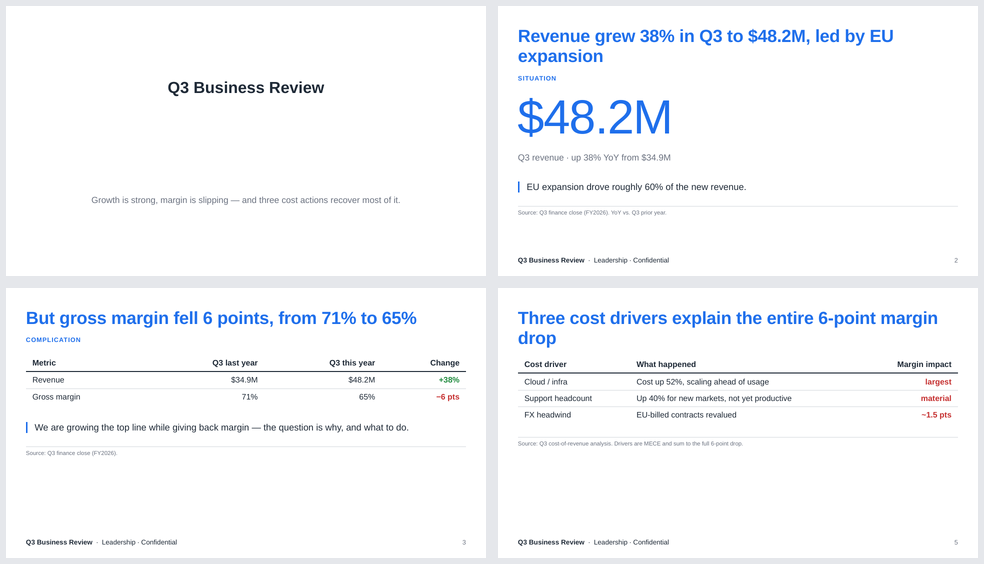](gallery/templates/consulting/live.html)

[View live](gallery/templates/consulting/live.html) ·
[Source](gallery/templates/consulting)

### Marketing / product

Expressive brochure style (the `monocle-brochure` theme) — bold cover, framed
screenshots, stat rows. For launches and pitches.

[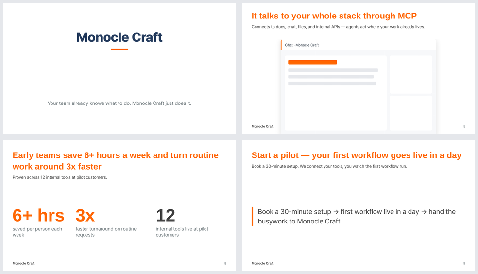](gallery/templates/marketing/live.html)

[View live](gallery/templates/marketing/live.html) ·
[Source](gallery/templates/marketing)

## Layout reference

A visual reference for wb-slide's built-in layouts — the rendered companion to
[`layouts.md`](layouts.md), which documents the syntax. Every image below was
produced from the showcase deck in [`docs/gallery/`](gallery/) with:

```bash
wb-slide export -d docs/gallery -o export.html   # then print to PDF / rasterize
```

The deck is styled by [`docs/gallery/styles/gallery.css`](gallery/styles/gallery.css)
— a small, self-contained stylesheet that overrides the six theme-contract
tokens (see [`theme-contract.md`](theme-contract.md)) for a clean, restrained
look. Swap in your own `styles/*.css` or a registry `theme:` to restyle.

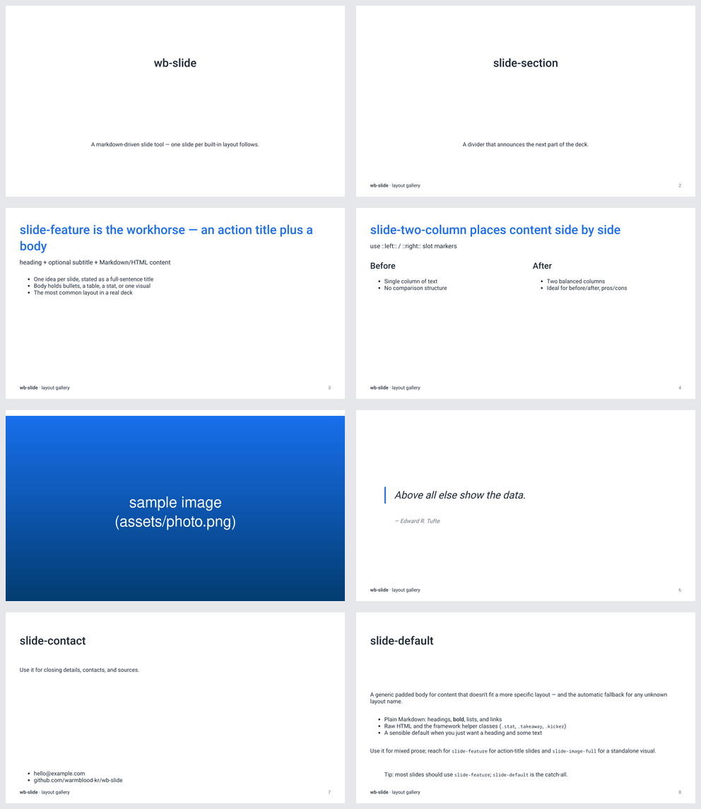

## The built-in layouts

Choose a layout per slide with the `layout:` frontmatter key. See
[`layouts.md`](layouts.md) for the exact frontmatter fields and slot syntax.

### `slide-cover`
Title / opening slide — centered, no chrome.

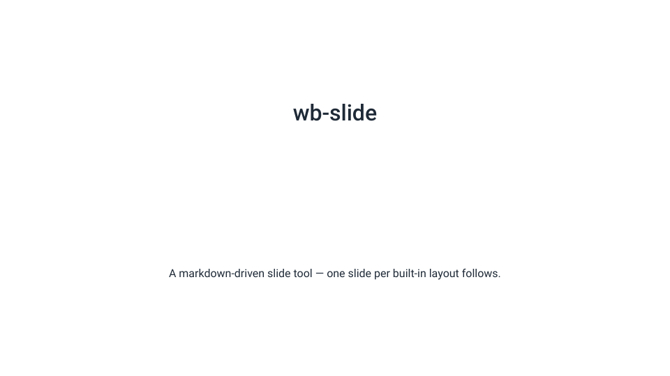

### `slide-section`
Section divider — large centered text.

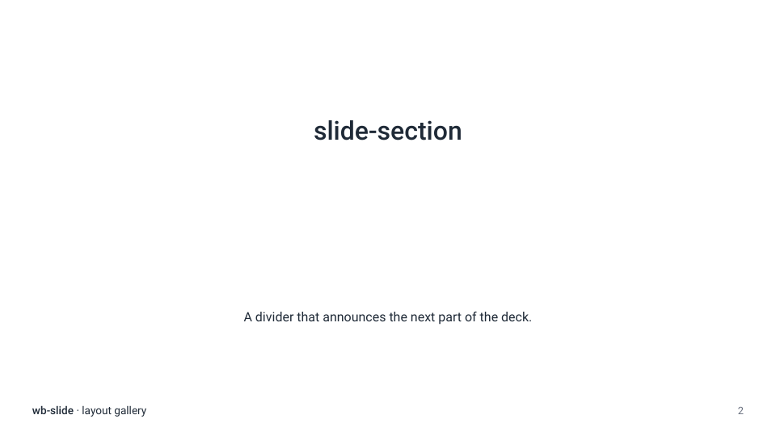

### `slide-feature`
The workhorse — an action-title `heading` (+ optional `subtitle`) over a
Markdown/HTML body. One idea per slide.

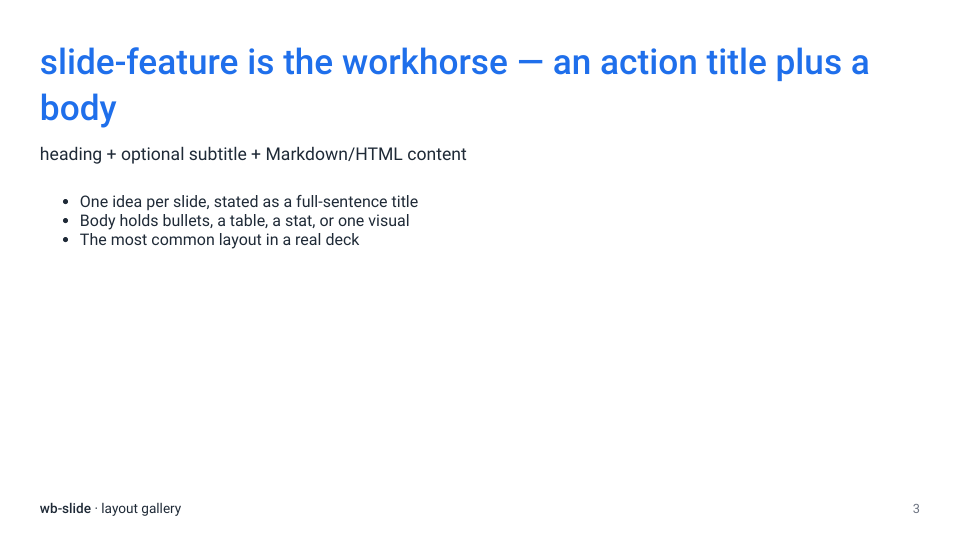

### `slide-two-column`
Side-by-side content via `::left::` / `::right::` slot markers — before/after,
pros/cons, text + visual.

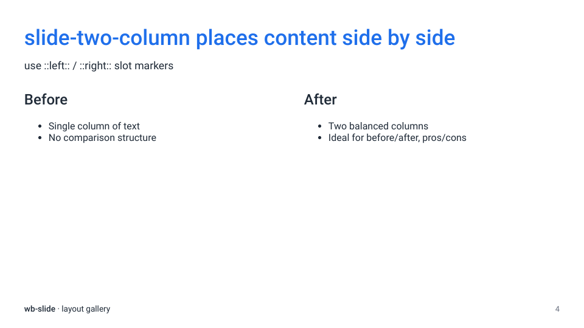

### `slide-image-full`
A single full-bleed image (screenshot, photo, or a pre-rendered chart).

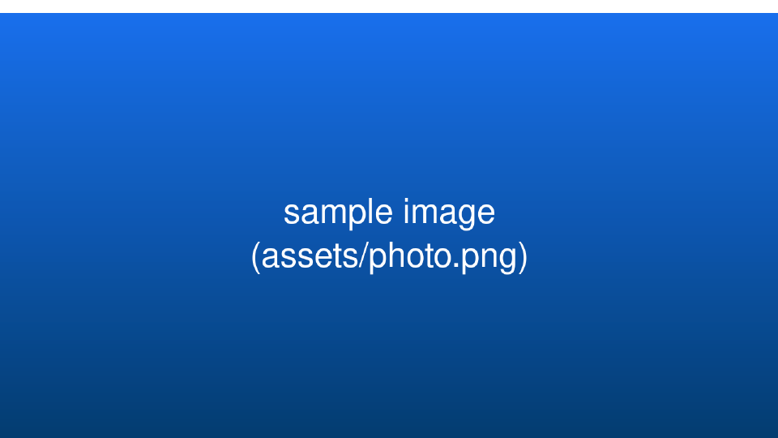

### `slide-quote`
A pull quote from the `quote` + `author` frontmatter.

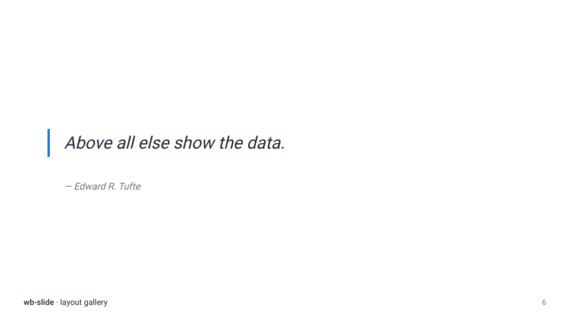

### `slide-contact`
Closing details — contacts, sources, endnotes. Left-aligned.

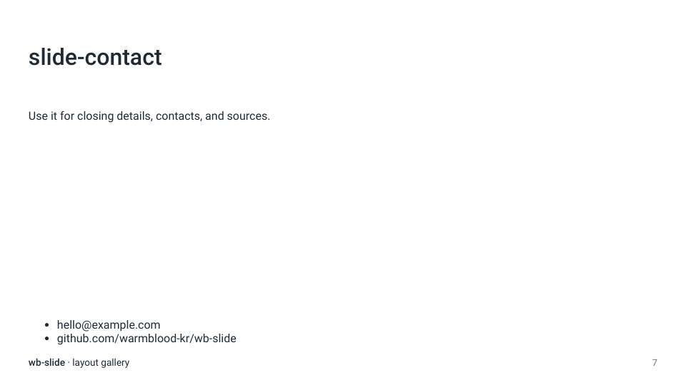

### `slide-default`
A generic padded body, and the fallback for any unknown layout name.

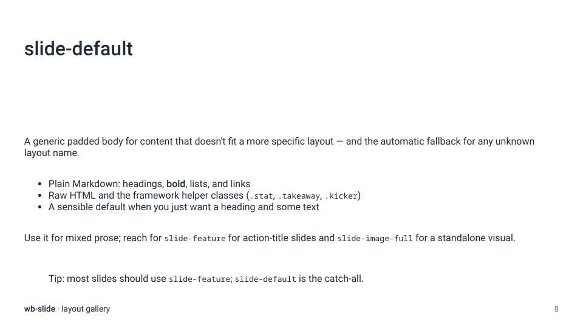

---

> Reproducing this gallery: render `docs/gallery/` (above), then print the
> exported HTML to PDF in a browser and rasterize the pages to PNG (the canvas
> is 960×540). The committed images live in [`docs/gallery/img/`](gallery/img/).
