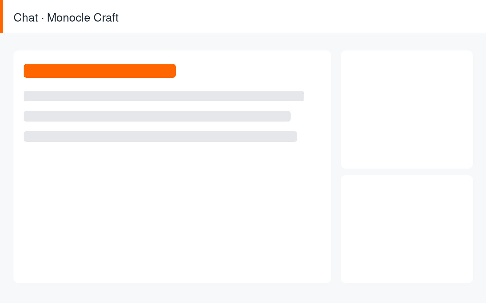
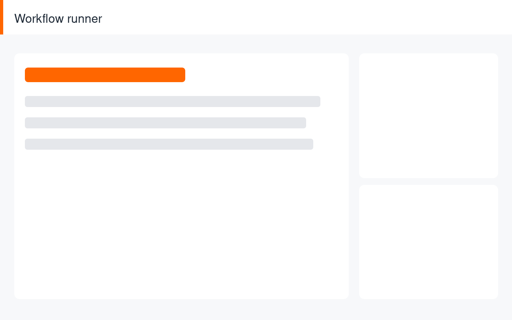
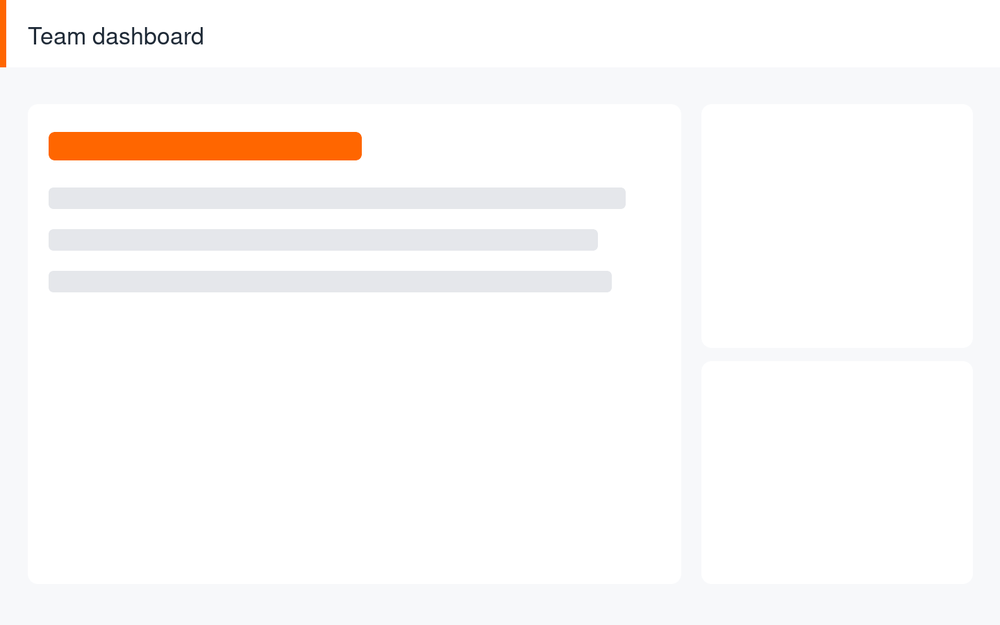

# Monocle Craft

Your team already knows what to do. Monocle Craft just does it.

---
layout: slide-feature
heading: Knowledge workers lose ~9 hours a week to repetitive busywork
subtitle: Copy-paste between tools, reformatting, and lookups quietly eat a full day every week.
---

~9 hrs

lost per person, every week, to work no one should have to do by hand

---
layout: slide-feature
heading: Monocle Craft runs that busywork as agents, right inside your tools
subtitle: An AI agent runtime that turns plain-language instructions into multi-step work — no glue code.
---

---
layout: slide-section
---

# Three things make Monocle Craft different

---
layout: slide-brochure-feature
heading: It talks to your whole stack through MCP
subtitle: Connects to docs, chat, files, and internal APIs — agents act where your work already lives.
---

---
layout: slide-brochure-feature
heading: It runs real workflows, not just chat
subtitle: Multi-step, tool-using agents carry a request from instruction to finished result.
---

---
layout: slide-brochure-feature
heading: It is enterprise-safe by default
subtitle: Tenant isolation, SSO, and a full audit trail — security your IT team signs off on.
---

---
layout: slide-feature
heading: Early teams save 6+ hours a week and turn routine work around 3x faster
subtitle: Proven across 12 internal tools at pilot customers.
---

6+ hrs

saved per person each week

3x

faster turnaround on routine requests

12

internal tools live at pilot customers

---
layout: slide-feature
heading: Start a pilot — your first workflow goes live in a day
subtitle: Book a 30-minute setup. We connect your tools, you watch the first workflow run.
---

Book a 30-minute setup → first workflow live in a day → hand the busywork to Monocle Craft.

